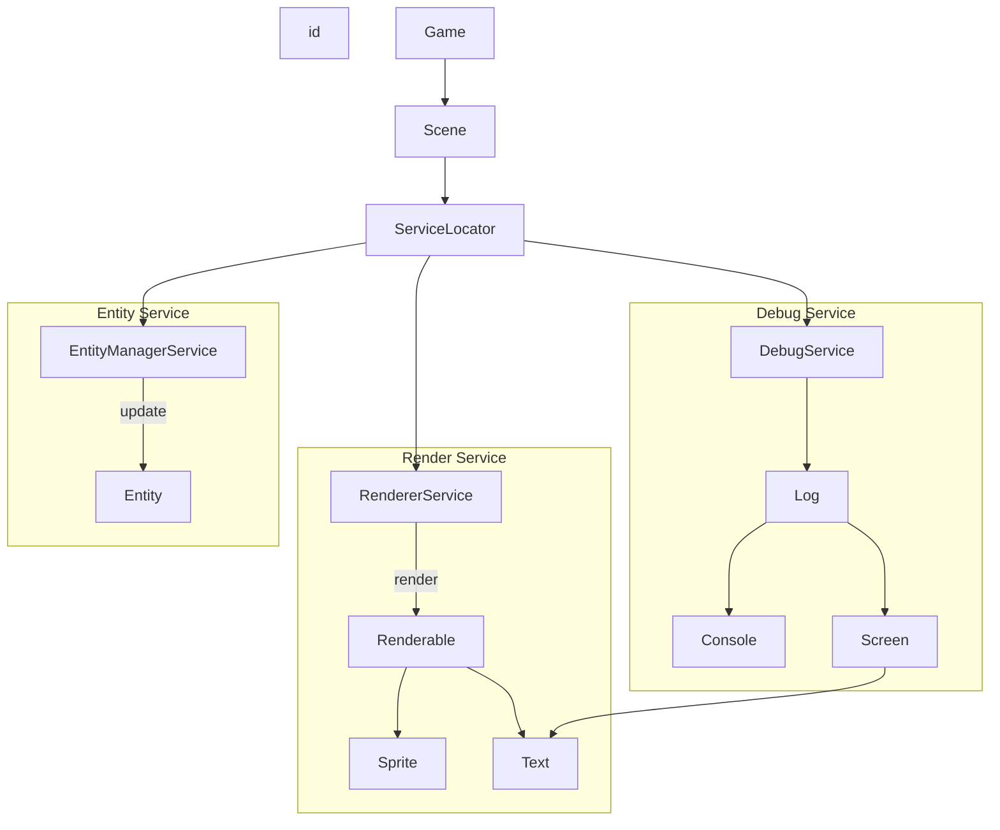
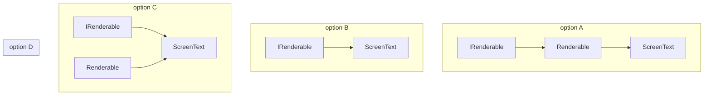

```mermaid
graph TD;
  id;

  Game --> Scene;
  Scene --> ServiceLocator;

  subgraph Render Service
  RendererService -- render --> Renderable;
  Renderable --> Sprite;
  Renderable --> Text;
  end

  subgraph Debug Service
  DebugService --> Log;
  Log --> Console;
  Log --> Screen;
  Screen --> Text;
  end

  subgraph Entity Service
  EntityManagerService -- update --> Entity;
  end

  ServiceLocator --> DebugService;
  ServiceLocator --> RendererService;
  ServiceLocator --> EntityManagerService;
```

```mermaid
graph TD;
  subgraph option A
  IRenderable --> Renderable --> ScreenText;
  end

  subgraph option B
  BIR[IRenderable] --> BST[ScreenText];
  end

  subgraph option C
  CIR[IRenderable] --> CST[ScreenText];
  CR[Renderable] --> CST;
  end

  subgraph option D
  end
```